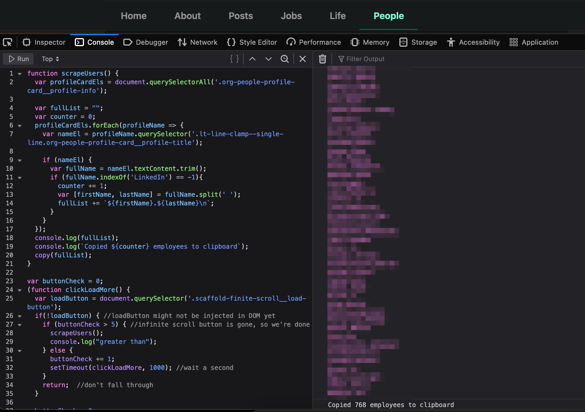

# LinkedIn Employee Scraper
Scrape employee first and last names from the People section of a company's LinkedIn profile using the Web Developer Tools Console... because none of the remote tools work anymore afaict. 
The code performs an automated lazy loading of the entire page and when that's done pulls all the username's from the DOM and prints them to the console output window.

## Issues
The copy() function meant to automatically copy all the names to the clipboard does not currently work when called from a setTimer callback, so either manually copy/paste all the users from the console output or run the body of the scrape() function by itself after the lazy loading of the entire page has finished.

## Usage
    - Navigate to a company's LinkedIn page and click on People.
    - Open the Browser's Web Developer Tools, paste scraper.js into the console as seen in the screenshot below and click Run.
    

